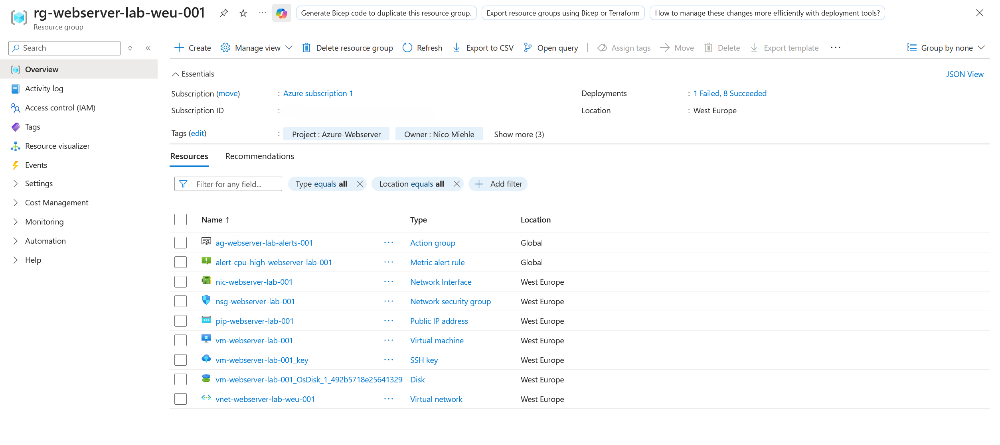
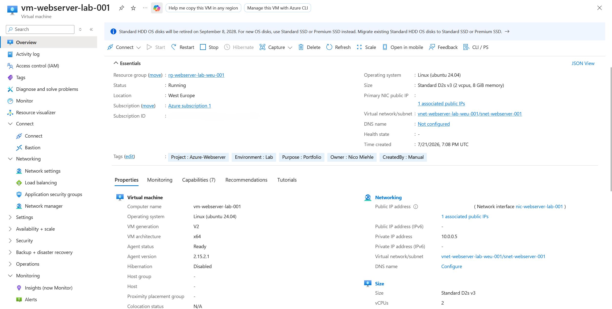
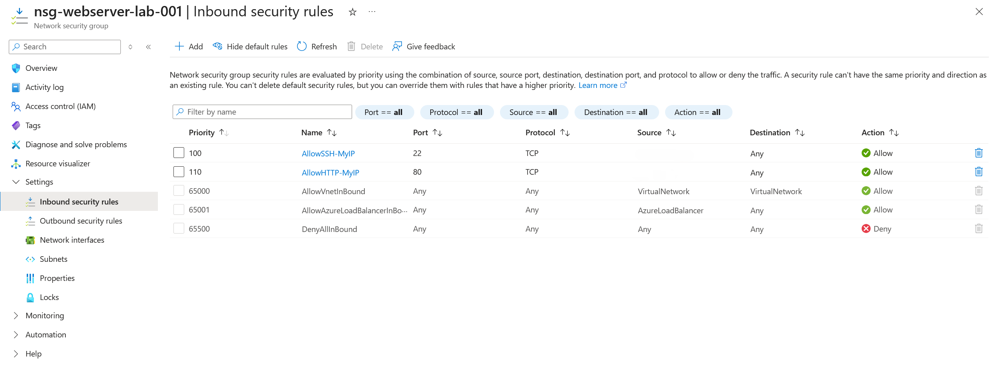
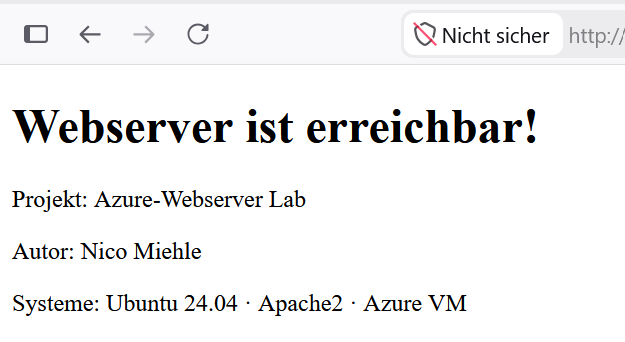
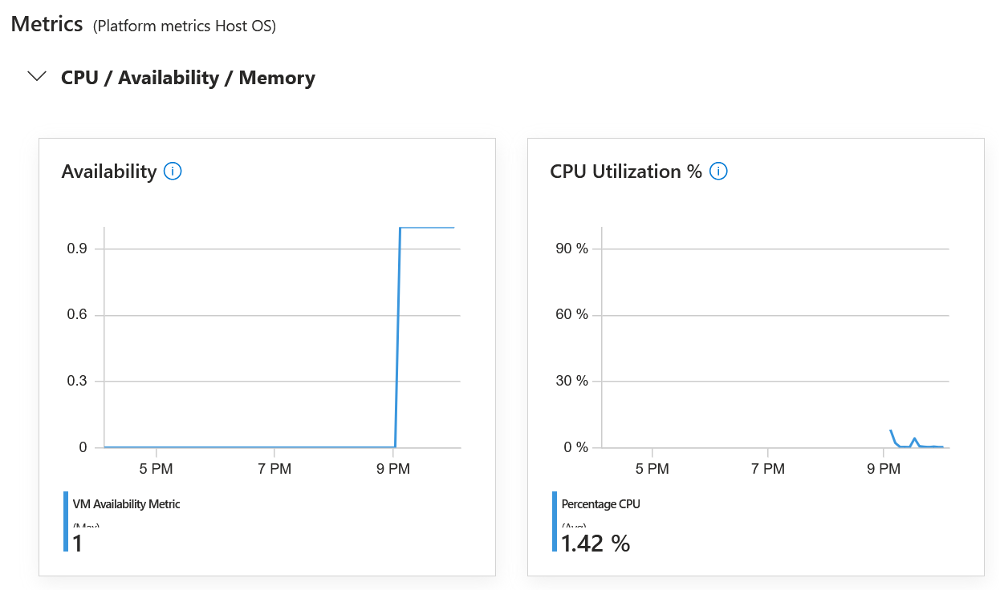
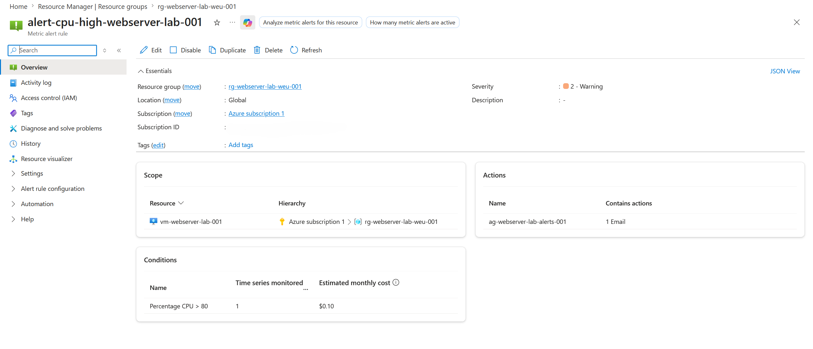

# Azure VM Web Server

Bereitstellung und Absicherung eines Webservers auf einer Azure VM – ein praktisches Lab-Projekt zu Azure Grundlagen, Netzwerksicherheit und Basic Monitoring.

## Was wurde gebaut

Eine Ubuntu-VM in West Europe, eingebettet in ein eigenes Virtual Network mit dediziertem Subnetz. Der Zugriff ist über eine Network Security Group auf das Nötigste beschränkt, ein Apache2-Webserver läuft und liefert eine individuell angepasste Startseite aus.

**Ressourcen:**
- Resource Group: `rg-webserver-lab-weu-001`
- Virtual Network: `vnet-webserver-lab-weu-001` (10.0.0.0/16), Subnetz `snet-webserver-001` (10.0.0.0/24)
- Virtual Machine: `vm-webserver-lab-001` – Ubuntu 24.04 LTS, Standard D2s v3 (2 vCPUs, 8 GiB RAM)
- Network Security Group: `nsg-webserver-lab-001`
- Public IP: `pip-webserver-lab-001`
- Network Interface: `nic-webserver-lab-001`
- SSH Key: `vm-webserver-lab-001_key`
- Alert Rule: `alert-cpu-high-webserver-lab-001`
- Action Group: `ag-webserver-lab-alerts-001`

Die VM läuft als **Azure Spot Instance** mit Eviction Policy "Deallocate" – eine bewusste Entscheidung, um die Kosten für ein reines Lernprojekt gering zu halten. Das bedeutet, Azure kann die VM bei Kapazitätsengpässen automatisch abschalten, was für dieses Projekt kein Problem darstellt.

## Netzwerksicherheit

Die NSG lässt nur eingehenden Traffic zu, der wirklich gebraucht wird – alles andere wird über die Standard-Deny-Regel blockiert:

- Port 22 (SSH), beschränkt auf meine eigene IP, ausschließlich mit Public-Key-Authentifizierung, kein Passwort-Login erlaubt
- Port 80 (HTTP), ebenfalls beschränkt auf meine eigene IP, für den Zugriff auf Apache2

Statt die Ports für "Any" zu öffnen, habe ich sie bewusst auf meine eigene IP eingeschränkt, um die Angriffsfläche der VM so klein wie möglich zu halten.

## Webserver

Apache2 wurde auf der Ubuntu-VM installiert und läuft über Port 80. Die Standard-Startseite habe ich durch eine eigene ersetzt, die auf das Projekt und meinen Namen verweist – als sichtbarer Nachweis, dass Deployment und Zugriff funktionieren.

## Monitoring

Über Azure Monitor sind grundlegende Metriken der VM (CPU, Arbeitsspeicher, Netzwerkauslastung) einsehbar. Ergänzend ist eine Alert-Regel für hohe CPU-Auslastung eingerichtet, die bei Überschreitung eines Schwellwerts von 80% eine Benachrichtigung per E-Mail auslöst.

## Screenshots

**Ressourcenübersicht**

**Virtual Machine**

**NSG-Regeln**

**Webserver**

**Monitoring-Metriken**

**Alert-Regel-Konfiguration**

